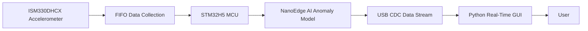

# Embedded Real-Time Accelerometer Anomaly Detection

---

## 🎯 Project Overview

During my internship, I developed a **real-time embedded anomaly detection system** using:

- **STM32H5 microcontroller**
- **ISM330DHCX 6-axis IMU (accelerometer + gyroscope)**
- **NanoEdge AI Studio anomaly detection model**
- **USB CDC data streaming**
- **Python visualization & monitoring GUI**

The system performs real-time data acquisition, inference, anomaly detection, and live visualization through a custom desktop application.

This repo documents:
- System architecture  
- Sensor pipeline  
- AI detection pipeline  
- GUI tooling  
- Firmware responsibilities  
- Engineering challenges & solutions  
- Skills demonstrated  

---

## 🧩 System Architecture

---

## 📦 Key Components
1. **Embedded Data Acquisition (STM32H5)**
- Configured ISM330DHCX accelerometer at ~1.6 kHz sampling
- Enabled FIFO streaming mode
- Captured 256-sample sliding windows across 3 axes
- Converted raw sensor readings into mg units
- Forwarded formatted float32 arrays via USB CDC in a custom binary frame:
[ 0xAA, 0x55, <payload of 256×3 float32> ]

2. **On-Device Anomaly Detection (NanoEdge AI)**
Implemented two modes:

🔹 **Learning Mode**
- Collects reference “normal” vibration signatures
- Builds the feature space into internal NEAI knowledge buffer
- Flash storage used to store learned knowledge
- Automatic “relearn” triggers when checksum mismatch detected

🔹 **Detection Mode**
- Processes each buffer through NEAI
- Produces similarity score (0–100)
- Detects anomalies based on similarity threshold
- Performs consecutive anomaly counting (e.g., 5 in a row → alert)

3. **PC Real-Time Visualization GUI (Python)**
Developed a Tkinter + Matplotlib GUI that:
- Connects over USB CDC COM port
- Visualizes real-time 3-axis accelerometer waveforms
- Displays:
-- Similarity score
-- Learning vs detection phase
-- Anomaly counter
-- Knowledge checksum status
- Parses both text-based logs and binary float frames
- Handles USB reconnection and noisy mixed data streams
- Maintains a rolling plot of 256 samples × 3 axes
GUI:

---

## 🧠 AI Pipeline Summary
flowchart TD
    A[256×3 Accelerometer Window] --> B[NEAI Preprocessing]
    B --> C[NanoEdge AI Model]
    C --> D{Similarity >= 90?}
    D -- Yes --> E[Normal Operation]
    D -- No --> F[Anomaly Count +1]
    F --> G{5 Consecutive?}
    G -- Yes --> H[Trigger Alert]
    G -- No --> A

---

## 🛠️ Engineering Challenges & Solutions
1. **Handling Mixed Binary + Text Serial Data**
The device sent both:
- Printable log messages
- Binary frames of float32 values
🛠️ **Solution:**
Implemented a custom streaming parser with a persistent bytearray buffer that detects:
- Binary header 0xAA55
- Complete float payload frames
- Text log lines separated by newline

2. **Ensuring Stable Learn/Detect Switching**
Issues:
- Flash checksum mismatches
- Relearning triggers
- Handling long button-press events
🛠️ **Solution:**
- Implemented debounced long/short press logic
- Added CRC-based flash validation
- Auto-relearn mode with visual feedback (LED & GUI)

3. **Real-Time Visualization Performance**
Plotting 768 float samples every 100 ms.
🛠️ **Optimizations:**
- Reused Matplotlib line objects
- Avoided figure redraw
- Used .set_data() for high FPS
- Async thread for reading serial

---

## 🧰 Skills Demonstrated
**Firmware / Embedded**
- I2C driver integration
- FIFO management
- DMA-like high-frequency sampling
- USB CDC data streaming
- Flash memory operations
- C programming + RTOS thread model
**AI / Data**
- Edge ML (NanoEdge AI)
- Vibration signal processing
- Similarity-based anomaly detection
- Dataset preparation & learning phase design
**Software / Tools**
- Python Tkinter GUI
- Matplotlib real-time plotting
- Serial COM data parsing
- Multithreaded UI programming
